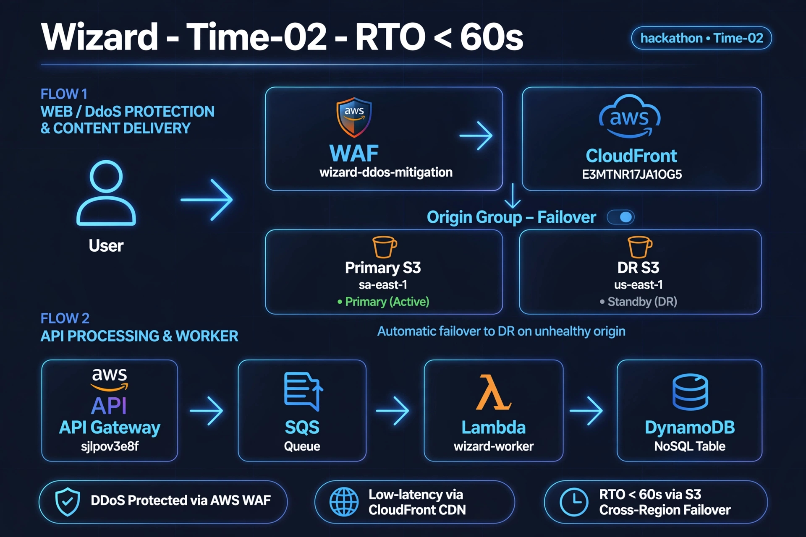
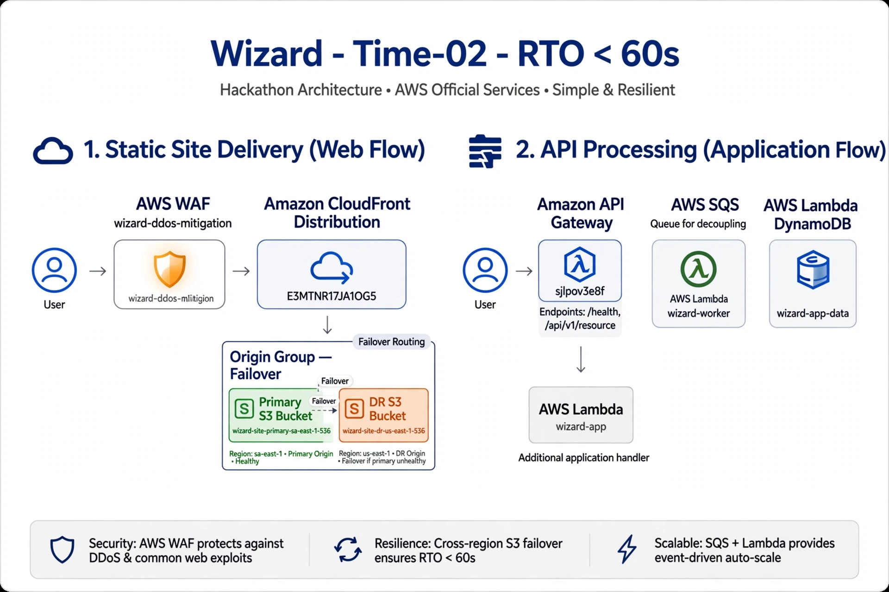

# 🧙‍♂️ WIZARD HACKATHON V2 - AI Security Lab



> Building the future of AI-powered Security Automation

**[PT-BR](#-pt-br) | [EN](#-en)**

---

### 🇧🇷 PT-BR - Laboratório de Resiliência e Automação
Plataforma completa de automação para Hackathon de Segurança com foco em Red Team & Blue Team e resiliência cloud.

**O que construí:**
- Orquestrador de times e containers Docker
- Sistema de pontuação em tempo real  
- Bots de ataque e defesa automatizados
- Proxy reverso com Nginx para isolamento
- Infraestrutura como código com Terraform
- Pipeline de evidências automatizado

**Arquitetura:**


**Stack:**
`Docker | Python | Terraform | AWS | Nginx | Linux`

**Como rodar:**
```bash
./RUN_ALL_V2.sh
# ou
docker compose up -d
